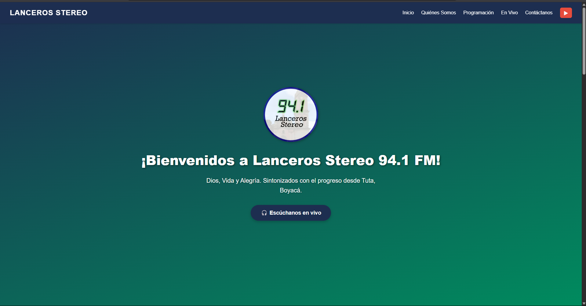

# 🎙️ Lanceros Stereo 94.1 FM - Landing Page

Bienvenido al repositorio oficial de la landing page de **Lanceros Stereo 94.1 FM**, una emisora comunitaria de Tuta, Boyacá que promueve la cultura, la educación y la alegría de nuestra región.

🌐 Sitio web en producción: [https://lancerostereofm.vercel.app](https://lancerostereofm.vercel.app)

📁 Repositorio GitHub: [https://github.com/juanitomanoplateada/lanceros-landing](https://github.com/juanitomanoplateada/lanceros-landing)

---

## 🛠️ Tecnologías Utilizadas

- [Angular 17](https://angular.io/) (con SSR y zoneless rendering)
- [SCSS](https://sass-lang.com/) para estilos personalizados
- [TypeScript](https://www.typescriptlang.org/)
- Canvas API para visualización de ondas de audio
- Vercel para despliegue automático

---

## 🚀 Características principales

- ✅ **Reproductor en Vivo:** Escucha la emisora en tiempo real, con animación de ondas sincronizada al audio.
- ✅ **Diseño Responsivo:** Optimizado para dispositivos móviles, tablets y escritorios.
- ✅ **Secciones informativas:** Quiénes somos, Programación, Contacto y más.
- ✅ **Despliegue automático en Vercel:** CI/CD para cada push a la rama principal.

---

## ▶️ Comenzar en local

1. Clona el repositorio:

```bash
git clone https://github.com/juanitomanoplateada/lanceros-landing.git
cd lanceros-landing
```

2. Instala las dependencias:

```bash
npm install
```

3. Ejecuta la app en modo desarrollo:

```bash
npm run dev
```

4. Para compilar y ver en SSR:

```bash
npm run build:ssr && npm run serve:ssr
```

---

## 🌍 Variables de entorno

El sitio reproduce el stream de audio desde una URL definida en el entorno.

En el archivo `main.server.ts` o configuración SSR:

```ts
{
  provide: 'STREAM_URL',
  useValue: process.env['STREAM_URL'],
}
```

Puedes definirla en `.env` o directamente en el entorno de Vercel:

```
STREAM_URL=http://link.zeno.fm/jz1bfxan45kuv
```

---

## 📦 Despliegue

Este sitio está configurado para desplegarse automáticamente en [Vercel](https://vercel.com/). Solo necesitas hacer push a la rama `main`.

---

## 📸 Vista previa

 <!-- Si agregas un preview -->

---

## 📬 Contacto

¿Tienes alguna sugerencia o mejora? ¡Contribuciones y pull requests son bienvenidos!

📧 contacto@lancerostereo.com  
📻 [Lanceros Stereo 94.1 FM](https://lancerostereofm.vercel.app)

---

## 📝 Licencia

Este proyecto está bajo la licencia MIT. Consulta el archivo `LICENSE` para más detalles.

